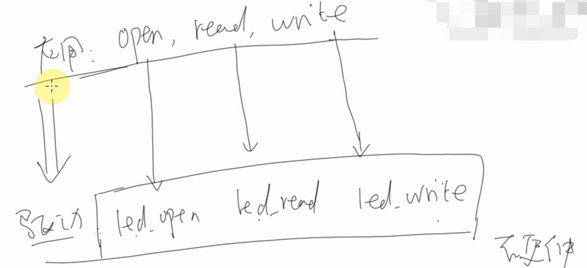
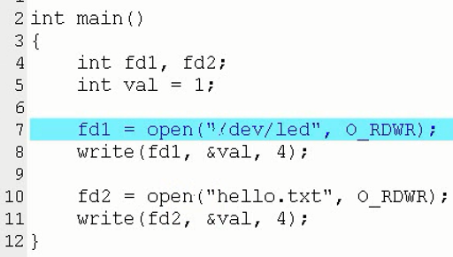
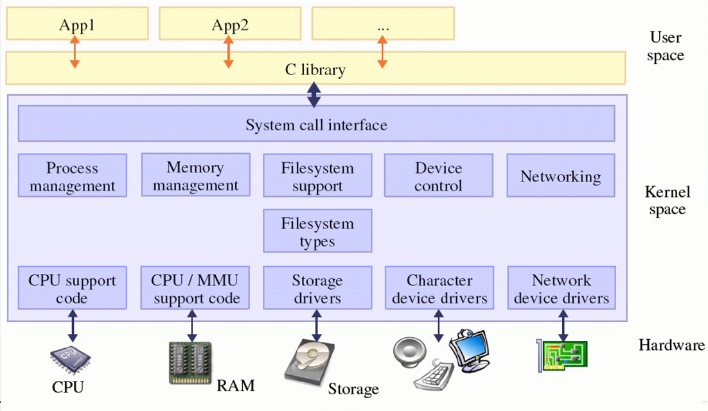
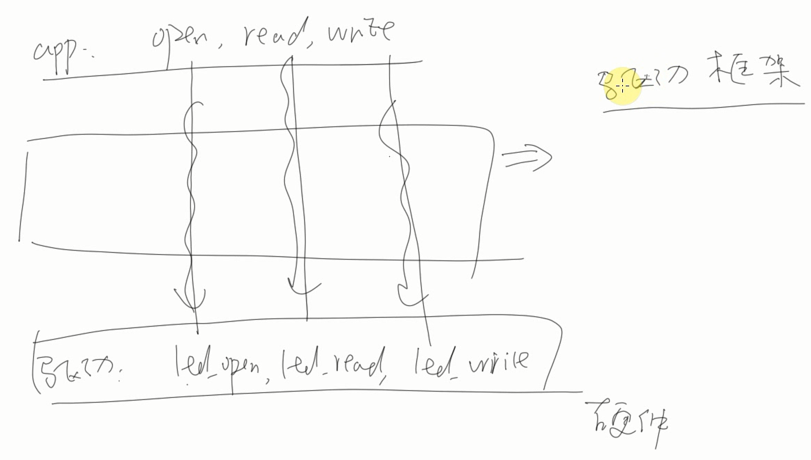

# 字符设备驱动程序之概念介绍

* u-boot用来启动内核，内核用来启动应用，应用程序直接调用封装好的系统调用或者库函数等标准接口实现底层驱动调用



* 库函数最终依然是调用系统调用，系统调用可以调用相应的驱动
* 这里 ```系统调用```跟驱动有所区别，但总归都是0特权级别。系统调用底层实现调用驱动
* 应用调用库函数，库函数调用系统调用，系统调用调用驱动。期间涉及的权限转换，你懂么？
* 系统调用的具体实现，IDT表中128号中断描述符，128号中断描述符对应syscall入口，入口是汇编，出口是汇编，中间会调用系统调用表（函数指针数组），根据EAX传递参数决定到底调用哪个系统调用。





* 必须要强调系统调用执行过程，其涉及到了体系结构相关的处理。但是不管哪种体系结构都涉及到了特权级切换。
* 应用程序通过标准接口操作硬件，驱动程序也要有对应处理函数，可以说，驱动必须提供回调函数供被调用处理



* 驱动是连接应用层和硬件的桥梁

## END
