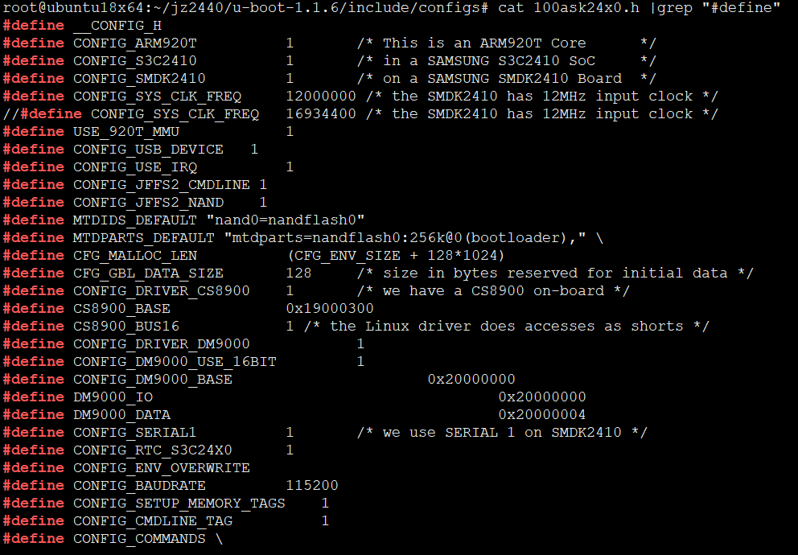
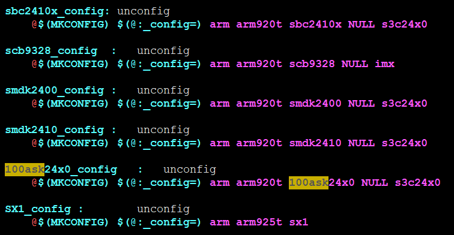
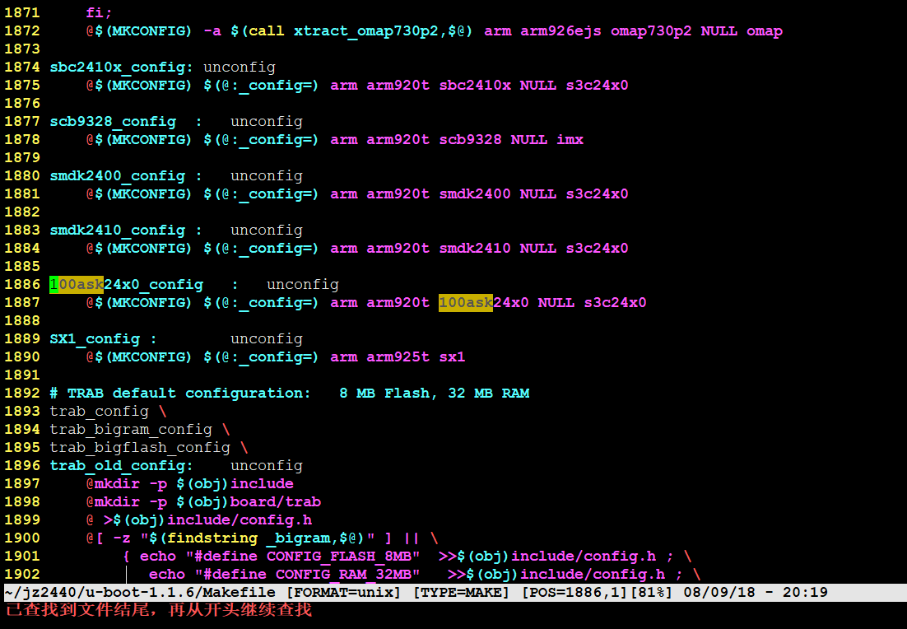

<!-- TOC depthFrom:1 depthTo:6 withLinks:1 updateOnSave:1 orderedList:0 -->

- [u-boot分析之Makefile结构分析](#u-boot分析之makefile结构分析)
	- [u-boot源码提供的剧透文件-README](#u-boot源码提供的剧透文件-readme)
		- [u-boot命名和拼写](#u-boot命名和拼写)
		- [u-boot版本号](#u-boot版本号)
		- [u-boot目录树](#u-boot目录树)
		- [u-boot配置](#u-boot配置)
		- [编译环境构建](#编译环境构建)
	- [阅读Makefile的重要性](#阅读makefile的重要性)
	- [分析配置过程](#分析配置过程)
	- [参考资料](#参考资料)

<!-- /TOC -->
# u-boot分析之Makefile结构分析

## u-boot源码提供的剧透文件-README

### u-boot命名和拼写

```
The "official" name of this project is "Das U-Boot". The spelling "U-Boot" shall be used in all written text (documentation, comments in source files etc.). Example:
	This is the README file for the U-Boot project.
File names etc. shall be based on the string "u-boot". Examples:
	include/asm-ppc/u-boot.h
	#include <asm/u-boot.h>
Variable names, preprocessor constants etc. shall be either based on the string "u_boot" or on "U_BOOT". Example:
	U_BOOT_VERSION		u_boot_logo
	IH_OS_U_BOOT		u_boot_hush_start
```

* u-boot官方名字应该是"Das U-Boot"
* 在所有文档、头文件、源文件中涉及到"Das U-Boot"的字符统一使用“u-boot”、"u_boot" 或 "U_BOOT"

### u-boot版本号

```
Versioning:
===========
U-Boot uses a 3 level version number containing a version, a sub-version, and a patchlevel: "U-Boot-2.34.5" means version "2", sub-version "34", and patchlevel "4".
The patchlevel is used to indicate certain stages of development between released versions, i. e. officially released versions of U-Boot will always have a patchlevel of "0".
```

* "U-Boot-2.34.5" 意味着主版本号 "2", 次版本号 "34", 补丁版本号 "4"
* 官方发布的新版本补丁版本号总是0，补丁版本号显示了开发者对官方版本的迭代

### u-boot目录树

```
Directory Hierarchy: ====================
- board		Board dependent files # 开发板相关，链接器脚本+低级初始化代码
- common	Misc architecture independent functions # 杂项
- cpu		CPU specific files # soc处理器相关
  - 74xx_7xx	Files specific to Freescale MPC74xx and 7xx CPUs
  - arm720t	Files specific to ARM 720 CPUs
  - arm920t	Files specific to ARM 920 CPUs  
    - at91rm9200 Files specific to Atmel AT91RM9200 CPU
    - imx	Files specific to Freescale MC9328 i.MX CPUs
    - s3c24x0	Files specific to Samsung S3C24X0 CPUs # 启动汇编+中断
  - arm925t	Files specific to ARM 925 CPUs
  - arm926ejs	Files specific to ARM 926 CPUs
  - arm1136	Files specific to ARM 1136 CPUs
  - at32ap	Files specific to Atmel AVR32 AP CPUs
  - i386	Files specific to i386 CPUs
  - ixp		Files specific to Intel XScale IXP CPUs
  - mcf52x2	Files specific to Freescale ColdFire MCF52x2 CPUs
  - mips	Files specific to MIPS CPUs
  - mpc5xx	Files specific to Freescale MPC5xx  CPUs
  - mpc5xxx	Files specific to Freescale MPC5xxx CPUs
  - mpc8xx	Files specific to Freescale MPC8xx  CPUs
  - mpc8220	Files specific to Freescale MPC8220 CPUs
  - mpc824x	Files specific to Freescale MPC824x CPUs
  - mpc8260	Files specific to Freescale MPC8260 CPUs
  - mpc85xx	Files specific to Freescale MPC85xx CPUs
  - nios	Files specific to Altera NIOS CPUs
  - nios2	Files specific to Altera Nios-II CPUs
  - ppc4xx	Files specific to AMCC PowerPC 4xx CPUs
  - pxa		Files specific to Intel XScale PXA CPUs
  - s3c44b0	Files specific to Samsung S3C44B0 CPUs
  - sa1100	Files specific to Intel StrongARM SA1100 CPUs
- disk		Code for disk drive partition handling # 磁盘
- doc		Documentation (don't expect too much) # 文档
- drivers	Commonly used device drivers # 驱动
- dtt		Digital Thermometer and Thermostat drivers # 驱动，数字式温度计和恒温器驱动器
- examples	Example code for standalone applications, etc. # 样例程序
- include	Header Files # 所有头文件存放于此
- lib_arm	Files generic to ARM	 architecture # arm架构相关
- lib_avr32	Files generic to AVR32	 architecture
- lib_generic	Files generic to all	 architectures
- lib_i386	Files generic to i386	 architecture
- lib_m68k	Files generic to m68k	 architecture
- lib_mips	Files generic to MIPS	 architecture
- lib_nios	Files generic to NIOS	 architecture
- lib_ppc	Files generic to PowerPC architecture
- net		Networking code # 网络代码
- post		Power On Self Test # 自举测试
- rtc		Real Time Clock drivers # 实时时钟驱动
- tools		Tools to build S-Record or U-Boot images, etc. # 代码构建工具
```
### u-boot配置

```
Software Configuration:
=======================
Configuration is usually done using C preprocessor defines; the rationale behind that is to avoid dead code whenever possible.
There are two classes of configuration variables:
* Configuration _OPTIONS_: These are selectable by the user and have names beginning with
  "CONFIG_". # 功能选项
* Configuration _SETTINGS_: These depend on the hardware etc. and should not be meddled with if
  you don't know what you're doing; they have names beginning with
  "CFG_".
Later we will add a configuration tool - probably similar to or even identical to what's used for the Linux kernel. Right now, we have to do the configuration by hand, which means creating some symbolic links and editing some configuration files. We use the TQM8xxL boards as an example here.
```

* 为了避免写死代码(兼容性不佳)，使用C预编译技术定义各种功能特性
* 策略类似于Linux内核配置


```
Selection of Processor Architecture and Board Type:
---------------------------------------------------
For all supported boards there are ready-to-use default configurations available; just type "make <board_name>_config".
Example: For a TQM823L module type:
	cd u-boot
	make TQM823L_config
For the Cogent platform, you need to specify the cpu type as well; e.g. "make cogent_mpc8xx_config". And also configure the cogent directory according to the instructions in cogent/README.
```

* 主要步骤，就会切换到源码路径下，然后"make <board_name>_config"


* 本质就是执行了Makefile的一条命令，具体含义后面分析。

```
Configuration Options:
----------------------
Configuration depends on the combination of board and CPU type; all such information is kept in a configuration file "include/configs/<board_name>.h".
Example: For a TQM823L module, all configuration settings are in "include/configs/TQM823L.h".
Many of the options are named exactly as the corresponding Linux kernel configuration options. The intention is to make it easier to build a config tool - later.
```

* 配置和选项会被放在"include/configs/<board_name>.h"这个头文件中，无非就是预处理使用的宏





* 有些选项是必须要有的

```
Configuration Settings:
-----------------------
- CFG_LONGHELP: Defined when you want long help messages included; undefine this when you're short of memory.
- CFG_PROMPT:	This is what U-Boot prints on the console to prompt for user input.
- CFG_CBSIZE:	Buffer size for input from the Console
- CFG_PBSIZE:	Buffer size for Console output
- CFG_MAXARGS:	max. Number of arguments accepted for monitor commands
- CFG_BARGSIZE: Buffer size for Boot Arguments which are passed to the application (usually a Linux kernel) when it is
		booted
***
```

* 配置以“CFG_”开头
* 有相当多的配置

### 编译环境构建

```
Building the Software:
======================
Building U-Boot has been tested in native PPC environments (on a PowerBook G3 running LinuxPPC 2000) and in cross environments (running RedHat 6.x and 7.x Linux on x86, Solaris 2.6 on a SPARC, and NetBSD 1.5 on x86).
If you are not using a native PPC environment, it is assumed that you have the GNU cross compiling tools available in your path and named with a prefix of "powerpc-linux-". If this is not the case, (e.g. if you are using Monta Vista's Hard Hat Linux CDK 1.2) you must change the definition of CROSS_COMPILE in Makefile. For HHL on a 4xx CPU, change it to:
	CROSS_COMPILE = ppc_4xx-
U-Boot is intended to be  simple  to  build.  After  installing	 the sources	 you must configure U-Boot for one specific board type. This is done by typing:
	make NAME_config
where "NAME_config" is the name of one of the existing configurations; the following names are supported:
	ADCIOP_config		FPS860L_config		omap730p2_config
	ADS860_config		GEN860T_config		pcu_e_config
	Alaska8220_config
	AR405_config		GENIETV_config		PIP405_config
	at91rm9200dk_config	GTH_config		QS823_config
	CANBT_config		hermes_config		QS850_config
	cmi_mpc5xx_config	hymod_config		QS860T_config
	cogent_common_config	IP860_config		RPXlite_config
	cogent_mpc8260_config	IVML24_config		RPXlite_DW_config cogent_mpc8xx_config	IVMS8_config		RPXsuper_config
	CPCI405_config		JSE_config		rsdproto_config
	CPCIISER4_config	LANTEC_config		Sandpoint8240_config
	csb272_config		lwmon_config		sbc8260_config
	CU824_config		MBX860T_config		sbc8560_33_config
	DUET_ADS_config		MBX_config		sbc8560_66_config
	EBONY_config		MPC8260ADS_config	SM850_config
	ELPT860_config		MPC8540ADS_config	SPD823TS_config
	ESTEEM192E_config	MPC8540EVAL_config	stxgp3_config
	ETX094_config		MPC8560ADS_config	SXNI855T_config
	FADS823_config		NETVIA_config		TQM823L_config
	FADS850SAR_config	omap1510inn_config	TQM850L_config
	FADS860T_config		omap1610h2_config	TQM855L_config
	FPS850L_config		omap1610inn_config	TQM860L_config omap5912osk_config	walnut_config
				omap2420h4_config	Yukon8220_config ZPC1900_config
Note: for some board special configuration names may exist; check if additional information is available from the board vendor; for
      instance, the TQM823L systems are available without (standard)
      or with LCD support. You can select such additional "features" when chosing the configuration, i. e.
      make TQM823L_config
	- will configure for a plain TQM823L, i. e. no LCD support
      make TQM823L_LCD_config
	- will configure for a TQM823L with U-Boot console on LCD
      etc.
Finally, type "make all", and you should get some working U-Boot images ready for download to / installation on your system:
- "u-boot.bin" is a raw binary image
- "u-boot" is an image in ELF binary format
- "u-boot.srec" is in Motorola S-Record format
```

* 必须指定交叉编译器，PC机器一般intel体系架构，与arm架构不兼容
* “make NAME_config”进行配置，无非就是调用Makefile中的“NAME_config”目标，本质是条命令



```
root@ubuntu18x64:~/jz2440/u-boot-1.1.6/include/configs# arm
arm2hpdl             arm-linux-as         arm-linux-cpp        arm-linux-gcc-3.4.5  arm-linux-gprof      arm-linux-objcopy    arm-linux-readelf    arm-linux-strip
arm-linux-addr2line  arm-linux-c++        arm-linux-g++        arm-linux-gccbug     arm-linux-ld         arm-linux-objdump    arm-linux-size       
arm-linux-ar         arm-linux-c++filt    arm-linux-gcc        arm-linux-gcov       arm-linux-nm         arm-linux-ranlib     arm-linux-strings  
```

如果没有配置交叉编译器，其实就是将其放到PATH环境变量即可

```
export PATH=/root/jz2440/gcc-3.4.5-glibc-2.3.6/bin:$PATH
```

* 配置好后执行make all也可以是make就可以了，因为默认第一个目标就是all。


* 最终生成u-boot.bin其实是u-boot这个elf格式程序提取之后的，使用arm-linux-objcopy提取

```
arm-linux-objcopy --gap-fill=0xff -O srec /tmp/build/u-boot /tmp/build/u-boot.srec
arm-linux-objcopy --gap-fill=0xff -O binary /tmp/build/u-boot /tmp/build/u-boot.bin
```

## 阅读Makefile的重要性


* U-Boot-1.1.6中包含诸多文件，如果要了解其究竟使用了哪些文件、文件的执行顺序、可执行程序占用内存的情况，最好的办法就是阅读Makefile。
* Linux项目分析工程结构最好的办法就是分析Makefile


Linux惯用套路，先配置再编译


## 分析配置过程

```
make 100ask24x0_config
```



在Makefile中肯定是个目标

```
MKCONFIG	:= $(SRCTREE)/mkconfig
export MKCONFIG

...

100ask24x0_config	:	unconfig
	@$(MKCONFIG) $(@:_config=) arm arm920t 100ask24x0 NULL s3c24x0

```

这里没有几个Makefile的知识

1. ‘@’开头

** @表示在执行命令时不输出命令本身，只输出结果。**这个符串通常用在“规则”行中，表示不显示命令本身，而只显示它的结果，例如Makefile中的内容为：
```
DIR_OBJ=./obj
CMD_MKOBJDIR=if [ -d ${DIR_OBJ} ]; then exit 0; else mkdir ${DIR_OBJ}; fi

mkobjdir:
	@${CMD_MKOBJDIR}
```
命令行执行如下：
```
make mkobjdir
```
此时不会显示在命令行不会显示出if [ -d ${DIR_OBJ} ]; then exit 0; else mkdir ${DIR_OBJ}; fi，但如果规则行的TAB后没有以@开头，则会显示，不信可以试试。

2. Makefile自定义变量

	- Makefile自定义的变量引用方式是${VarName}
	- Makefile中引用shell环境变量方式是 $${VarName}

3. $(@:_config=)

	- ```$(@:_config=) ```其中@表示目标100ask24x0_config，整个表示把目标中的_config替换成空
	- 替换之后变量$@的值就变成了临时变量的100ask24x0
	- makefile的变量替换规则，**$(VAR:A=B)表示替换变量$VAR中的A为B**，即把$@中的_config替换为空变成100ask24x0
	- **$@ 目标文件，$^ 所有的依赖文件，$< 第一个依赖文件。**


```
MKCONFIG	:= $(SRCTREE)/mkconfig
export MKCONFIG

...

100ask24x0_config	:	unconfig
	@$(MKCONFIG) $(@:_config=) arm arm920t 100ask24x0 NULL s3c24x0

```
这句话本质就是执行命令
```
mkconfig 100ask24x0  arm arm920t 100ask24x0 NULL s3c24x0
```
所谓配置本质就是执行了这个命令，要具体了解配置干了啥，就得去看mkconfig命令的实现。
只有八十来行，直接贴出阿里。是个实实在在的shell脚本文件

```
     1	#!/bin/sh -e
     2
     3	# Script to create header files and links to configure
     4	# U-Boot for a specific board.
     5	#
     6	# Parameters:  Target  Architecture  CPU  Board [VENDOR] [SOC]
     7	#
     8	# (C) 2002-2006 DENX Software Engineering, Wolfgang Denk <wd@denx.de>
     9	#
    10
    11	APPEND=no	# Default: Create new config file
    12	BOARD_NAME=""	# Name to print in make output
    13
    14	while [ $# -gt 0 ] ; do  # $#表示参数个数 gt 表示greater than，大于
    15		case "$1" in
    16		--) shift ; break ;;
    17		-a) shift ; APPEND=yes ;;
    18		-n) shift ; BOARD_NAME="${1%%_config}" ; shift ;;
    19		*)  break ;;
    20		esac
    21	done
    22
    23	[ "${BOARD_NAME}" ] || BOARD_NAME="$1" # 如果参数定义了执行赋值，否则不动
    24
    25	[ $# -lt 4 ] && exit 1 # 参数至少有[4,6]个
    26	[ $# -gt 6 ] && exit 1
    27
    28	echo "Configuring for ${BOARD_NAME} board..."
    29
    30	#
    31	# Create link to architecture specific headers
    32	#
    33	if [ "$SRCTREE" != "$OBJTREE" ] ; then    
    34		mkdir -p ${OBJTREE}/include      # SRCTREE := $(CURDIR)
    35		mkdir -p ${OBJTREE}/include2     # OBJTREE := $(if $(BUILD_DIR),$(BUILD_DIR),$(CURDIR)) 三目运算，如果没有定义$(BUILD_DIR)那就把$(BUILD_DIR)赋值为$(CURDIR)，否则不动
    36		cd ${OBJTREE}/include2
    37		rm -f asm
    38		ln -s ${SRCTREE}/include/asm-$2 asm
    39		LNPREFIX="../../include2/asm/"
    40		cd ../include
    41		rm -rf asm-$2
    42		rm -f asm
    43		mkdir asm-$2
    44		ln -s asm-$2 asm
    45	else
    46		cd ./include
    47		rm -f asm
    48		ln -s asm-$2 asm # 建立链接文件 $2 = arm
    49	fi
    50
    51	rm -f asm-$2/arch # 移除asm-arm目录
    52  # mkconfig 100ask24x0  arm arm920t 100ask24x0 NULL s3c24x0
    53	if [ -z "$6" -o "$6" = "NULL" ] ; then
    54		ln -s ${LNPREFIX}arch-$3 asm-$2/arch
    55	else
    56		ln -s ${LNPREFIX}arch-$6 asm-$2/arch # ln -s arch-s3c24x0 asm-arm/arch
    57	fi
    58   
    59	if [ "$2" = "arm" ] ; then
    60		rm -f asm-$2/proc
    61		ln -s ${LNPREFIX}proc-armv asm-$2/proc # ln -s proc-armv asm-arm/proc
    62	fi
    63
    64	#
    65	# Create include file for Make 生成配置文件
    66	# mkconfig 100ask24x0  arm arm920t 100ask24x0 NULL s3c24x0
    67	echo "ARCH   = $2" >  config.mk
    68	echo "CPU    = $3" >> config.mk
    69	echo "BOARD  = $4" >> config.mk
    70
    71	[ "$5" ] && [ "$5" != "NULL" ] && echo "VENDOR = $5" >> config.mk
    72
    73	[ "$6" ] && [ "$6" != "NULL" ] && echo "SOC    = $6" >> config.mk
    74
    75	#
    76	# Create board specific header file
    77	#
    78	if [ "$APPEND" = "yes" ]	# Append to existing config file
    79	then
    80		echo >> config.h
    81	else
    82		> config.h		# Create new config file
    83	fi
    84	echo "/* Automatically generated - do not edit */" >>config.h
    85	echo "#include <configs/$1.h>" >>config.h
    86
    87	exit 0
```


配置文件，uboot支持哪些命令就是在这里修改


## 参考资料

Makefile基本用法想看Github博客<http://github.com/yifengyou/learn-makefile>

```
视频里面讲的其实也不是很详细，只是点到为止，没有做梳理总结，你需要数量掌握Makefile的
身为一个Linux程序员尤其是搞嵌入式的，如果Makefile不熟悉，呵呵
知识点总结人可没功夫替你弄好，你需要自己来，把别人的东西彻底消化
```
